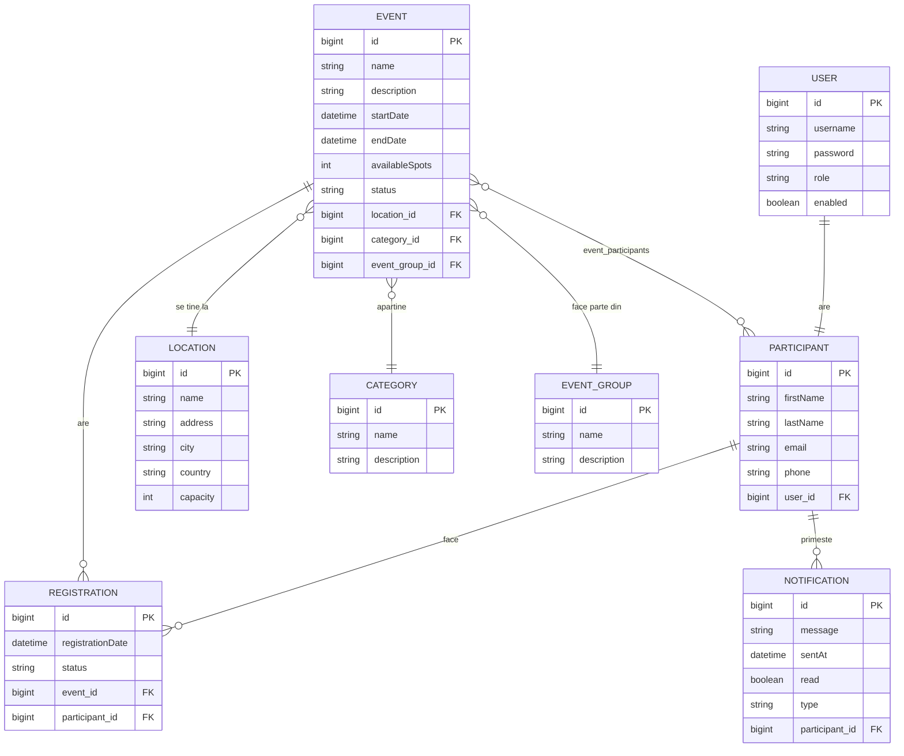

# Event Manager

## Descriere
Platformă de management evenimente cu arhitectură de microservicii, construită cu Spring Boot și Spring Cloud.

## Diagrama ER

## Relații între entități
- User @OneToOne Participant
- EventGroup @OneToMany Event
- Category @OneToMany Event
- Location @OneToMany Event
- Event @ManyToMany Participant (prin tabela event_participants)
- Participant @OneToMany Registration
- Event @OneToMany Registration
- Participant @OneToMany Notification

## Arhitectură Microservicii

[Client] → [API Gateway :8080] → [Event Service :8082]
→ [User Service :8081]
→ [Notification Service :8083]
[Eureka Server :8761] ← toate serviciile se înregistrează
[Config Server :8888] ← toate serviciile fetch configurații

### Servicii
- **config-server** (port 8888) — configurare centralizată Spring Cloud Config
- **eureka-server** (port 8761) — service discovery Netflix Eureka
- **api-gateway** (port 8080) — routing centralizat Spring Cloud Gateway
- **user-service** (port 8081) — autentificare și gestionare utilizatori
- **event-service** (port 8082) — evenimente, înregistrări, Saga Pattern
- **notification-service** (port 8083) — notificări participanți

## Setup Instructions

### Cerințe
- Java 17+
- PostgreSQL 17 (port 5433)
- Maven 3.8+

### Pași
1. Creează baza de date PostgreSQL: `CREATE DATABASE eventmanager;`
2. Clonează toate repo-urile
3. Pornește serviciile în ordine:
    - eureka-server
    - config-server
    - user-service
    - notification-service
    - event-service
    - api-gateway
4. Accesează aplicația la `http://localhost:8080/events`
5. Login cu: admin/admin123 (ADMIN) sau user/user123 (USER)

## API Documentation

### Event Service (port 8082)
- GET /api/events — lista evenimente
- POST /api/events — creare eveniment
- GET /api/events/{id} — detalii eveniment
- PUT /api/events/{id} — actualizare eveniment
- DELETE /api/events/{id} — ștergere eveniment
- POST /api/events/{eventId}/register/{userId} — înregistrare user la eveniment

### User Service (port 8081)
- GET /api/users — lista utilizatori
- POST /api/users — creare utilizator
- GET /api/users/{id} — detalii utilizator
- GET /api/users/username/{username} — căutare după username

### Notification Service (port 8083)
- GET /api/notifications/participant/{id} — notificări participant
- POST /api/notifications/participant/{id} — creare notificare
- PATCH /api/notifications/{id}/read — marcare ca citită

## Tehnologii
- Spring Boot 4.0.7
- Spring Cloud (Eureka, Gateway, Config, OpenFeign, LoadBalancer)
- Spring Security + BCrypt + Remember Me
- Spring Data JPA + Hibernate
- PostgreSQL (dev) + H2 (test)
- Thymeleaf + Bootstrap 5
- Resilience4j (Circuit Breaker + Retry)
- Spring Boot Actuator + Prometheus
- JUnit 5 + Mockito
- Logback (fișiere separate pentru erori)

## Design Patterns
- **Saga Pattern** — pentru înregistrarea distribuită la eveniment (EventRegistrationSaga)
- **Repository Pattern** — Spring Data JPA
- **Service Layer Pattern** — separarea logicii de business

## Contribuții
- Student solo