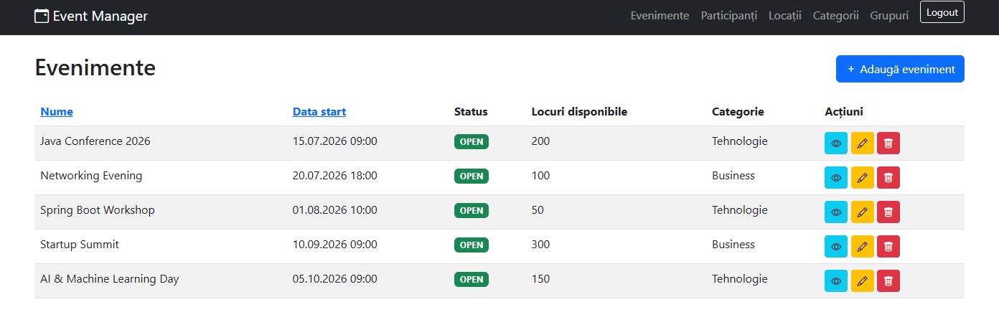
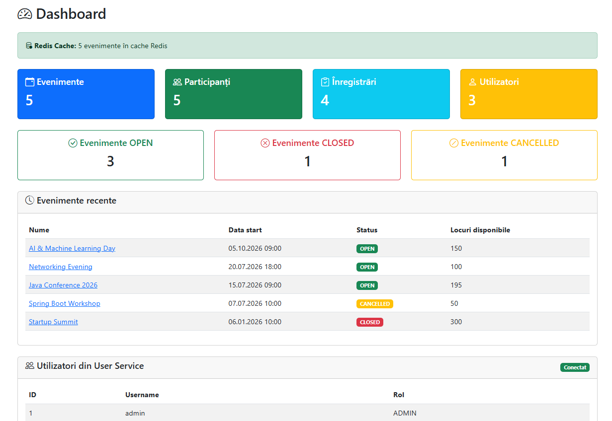
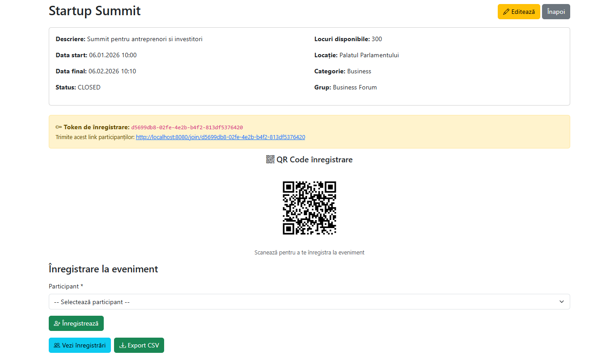
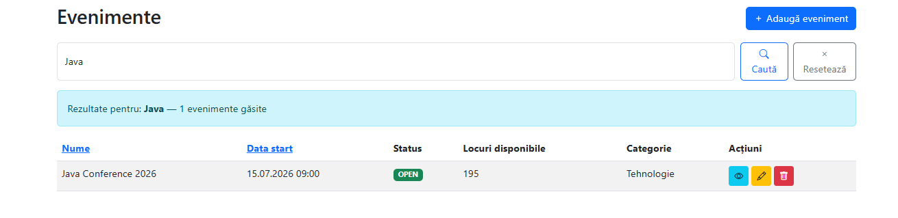
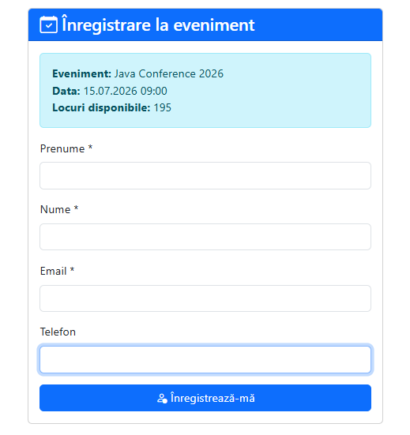
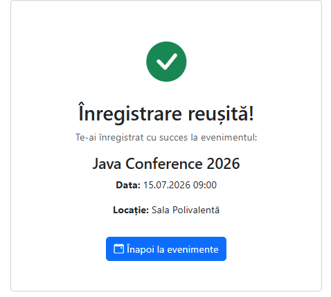
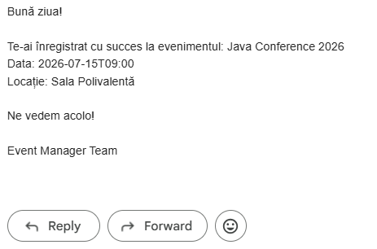
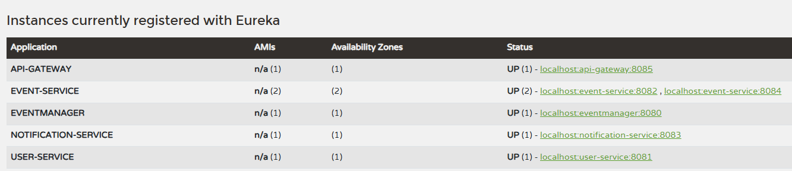
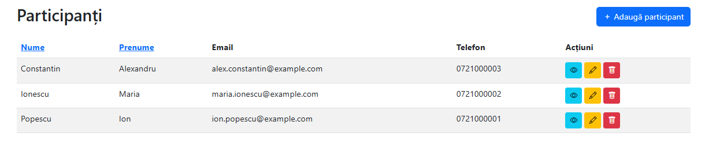
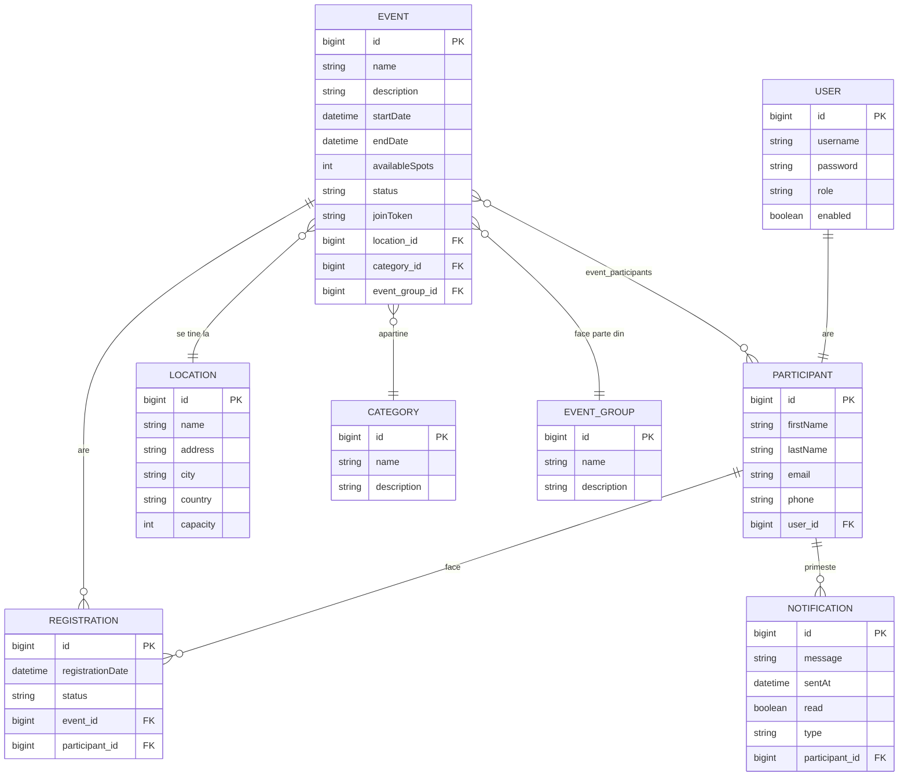

# Event Manager

## Descriere
Platformă de management evenimente cu arhitectură de microservicii, construită cu Spring Boot și Spring Cloud. Permite crearea și gestionarea evenimentelor, înregistrarea participanților prin token unic și QR code, notificări email automate și dashboard cu statistici în timp real.

## Screenshots

### Lista Evenimente


### Dashboard cu Redis Cache și User Service


### Detalii Eveniment - Token și QR Code


### Căutare Evenimente


### Formular Înregistrare cu Token


### Înregistrare Reușită


### Email Confirmare


### Eureka - Servicii Înregistrate


### Participanți


## Diagrama ER



## Relații între entități
- User @OneToOne Participant
- EventGroup @OneToMany Event
- Category @OneToMany Event
- Location @OneToMany Event
- Event @ManyToMany Participant (prin tabela event_participants)
- Participant @OneToMany Registration
- Event @OneToMany Registration
- Participant @OneToMany Notification

## Arhitectură

```
[Browser] ──→ [Monolith :8080] ──→ [User Service :8081]
                    │
                    └──→ [Notification Service :8083]

[API Gateway :8085] ──→ [Event Service :8082/:8084]
                    ──→ [User Service :8081]  
                    ──→ [Notification Service :8083]

[Eureka Server :8761] ← toate serviciile se înregistrează
[Config Server :8888] ← toate serviciile fetch configurații
[Redis :6379]         ← caching evenimente
```

### Servicii
- **eventmanager** (port 8080) — monolith cu UI Thymeleaf, integrat cu microservicii
- **config-server** (port 8888) — configurare centralizată Spring Cloud Config
- **eureka-server** (port 8761) — service discovery Netflix Eureka
- **api-gateway** (port 8085) — routing centralizat Spring Cloud Gateway
- **user-service** (port 8081) — autentificare și gestionare utilizatori + JWT
- **event-service** (port 8082/8084) — evenimente cu load balancing
- **notification-service** (port 8083) — notificări participanți

## Funcționalități
- **Token de înregistrare** — token UUID unic per eveniment, trimis participanților
- **QR Code** — generat automat din token, scanabil cu telefonul
- **Email notification** — confirmare automată după înregistrare (Gmail SMTP)
- **Export CSV** — export lista participanți per eveniment
- **Dashboard** — statistici în timp real + utilizatori din user-service
- **Căutare** — filtrare evenimente după nume sau descriere
- **Redis Cache** — caching evenimente cu @Cacheable și @CacheEvict
- **Comunicare inter-servicii** — monolith apelează user-service și notification-service via Feign

## Setup Instructions

### Cerințe
- Java 17+
- PostgreSQL 17 (port 5433)
- Redis (port 6379)
- Maven 3.8+

### Pornire Redis
```bash
cd "C:\Program Files\Redis"
redis-server.exe redis.windows.conf
```

### Pași
1. Creează baza de date PostgreSQL: `CREATE DATABASE eventmanager;`
2. Clonează toate repo-urile
3. Pornește serviciile în ordine:
   - `redis-server`
   - `eureka-server`
   - `config-server`
   - `user-service`
   - `notification-service`
   - `event-service` (port 8082)
   - `event-service` (port 8084 — load balancing)
   - `api-gateway`
   - `eventmanager` (monolith)
4. Accesează aplicația la `http://localhost:8080/events`
5. Login cu: `admin/admin123` (ADMIN) sau `user/user123` (USER)

## API Documentation

### Event Service (port 8082)
- GET /api/events — lista evenimente
- POST /api/events — creare eveniment
- GET /api/events/{id} — detalii eveniment
- PUT /api/events/{id} — actualizare eveniment
- DELETE /api/events/{id} — ștergere eveniment

### User Service (port 8081)
- GET /api/users — lista utilizatori
- POST /api/users — creare utilizator
- POST /api/users/authenticate — autentificare + JWT token

### Notification Service (port 8083)
- GET /api/notifications/participant/{id} — notificări participant
- POST /api/notifications/participant/{id} — creare notificare
- PATCH /api/notifications/{id}/read — marcare ca citită

## Tehnologii
- Spring Boot 4.0.7
- Spring Cloud (Eureka, Gateway, Config, OpenFeign, LoadBalancer)
- Spring Security + JDBC Auth + BCrypt + Remember Me
- Spring Data JPA + Hibernate
- PostgreSQL (dev) + H2 (test)
- Thymeleaf + Bootstrap 5
- Resilience4j (Circuit Breaker + Retry)
- Spring Boot Actuator + Prometheus
- JWT Authentication (inter-servicii)
- Redis + Spring Cache
- ZXing (QR Code generation)
- Spring Mail (Gmail SMTP)
- JUnit 5 + Mockito + JaCoCo (83% coverage)
- Logback (fișiere separate pentru erori)

## Design Patterns
- **Saga Pattern** — pentru înregistrarea distribuită la eveniment
- **Repository Pattern** — Spring Data JPA
- **Service Layer Pattern** — separarea logicii de business
- **Circuit Breaker Pattern** — Resilience4j
